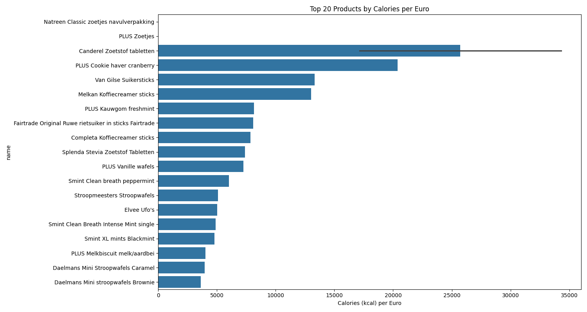
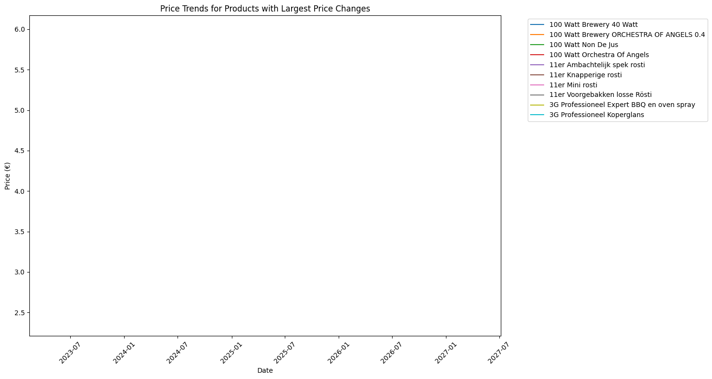
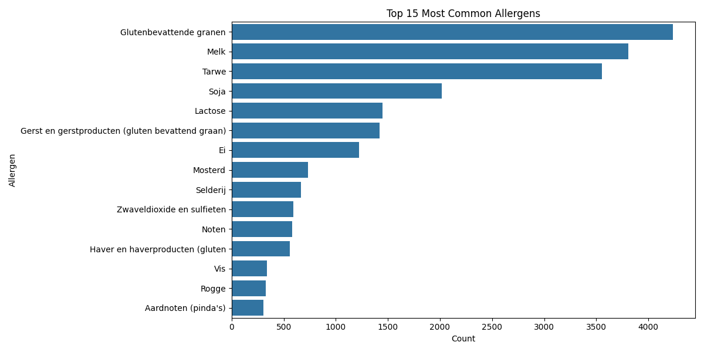
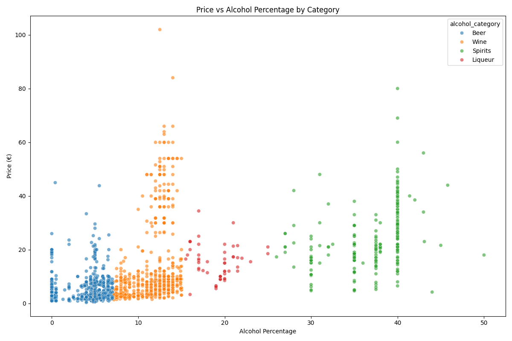
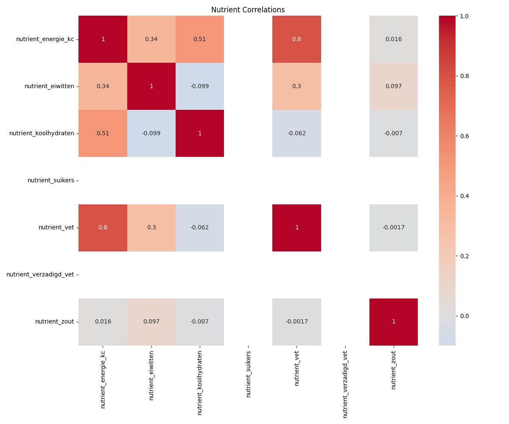
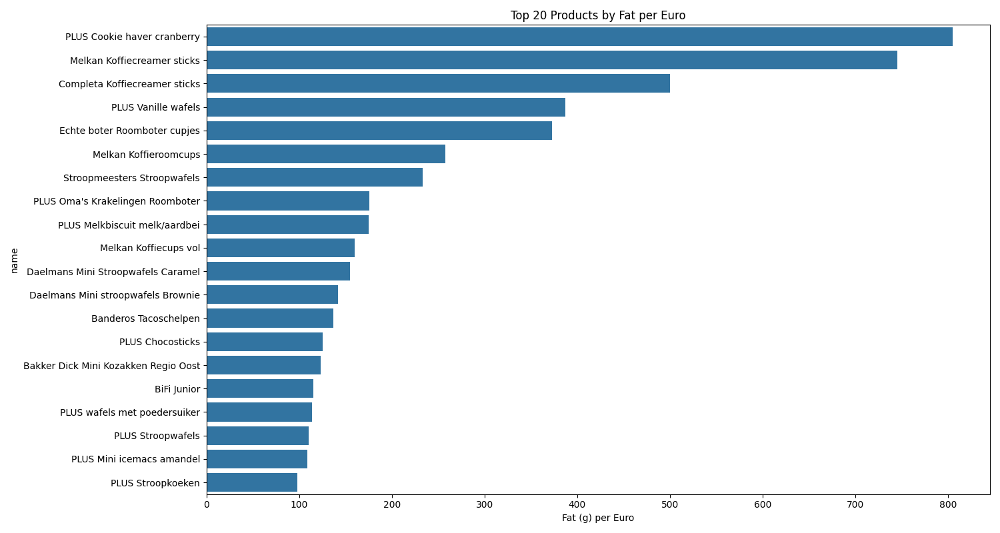

# 🛒 PLUS Product Analyzer

Een uitgebreide scraper en analyse-tool voor productinformatie van PLUS.nl, inclusief voedingswaarden, prijzen en ingrediënten.


## 📋 Inhoudsopgave

- [Overzicht](#overzicht)
- [Functies](#functies)
- [Installatie](#installatie)
- [Configuratie](#configuratie)
- [Gebruik](#gebruik)
- [Analyses & Visualisaties](#analyses--visualisaties)
- [Web Dashboard](#web-dashboard)
- [Projectstructuur](#projectstructuur)
- [Technische Details](#technische-details)

## 🎯 Overzicht

Dit project bestaat uit twee hoofdcomponenten:

1. **Product Scraper** - Verzamelt productgegevens van PLUS.nl via de officiële API
2. **Data Analyzer** - Analyseert de verzamelde gegevens met interactieve visualisaties

De tool kan duizenden producten scrapen en biedt inzicht in:
- Voedingswaarden en ingrediënten
- Prijs-kwaliteitsverhouding
- Merkanalyses
- Allergeneninformatie
- En veel meer!

## ✨ Functies

### 🕷️ Web Scraper
- **Sitemap Parsing** - Automatische detectie van alle product-URL's
- **API Integration** - Directe toegang tot de PLUS product-API
- **Proxy Support** - Rotatie voor schaalbaarheid
- **Cookie Management** - Automatisch beheer van sessie-cookies
- **Error Handling** - Robuuste foutafhandeling met retry-mechanismen
- **JSON Database** - Efficiënte opslag met TinyDB

### 📊 Data Analyse
- **Interactieve Visualisaties** - Plotly-gebaseerde grafieken
- **Web Dashboard** - Flask-gebaseerde web-interface
- **Voedingswaarde Analyse** - Protein-per-euro, calorieën, etc.
- **Ingrediënten Wordcloud** - Visuele weergave van populaire ingrediënten
- **Brand Comparison** - Vergelijking tussen verschillende merken
- **Price Distribution** - Prijsverdelingen en trends

## 🚀 Installatie

### Vereisten
- Python 3.8 of hoger
- Windows PowerShell (voor de meegeleverde scripts)

### Stap-voor-stap installatie

1. **Clone het project**
   ```bash
   git clone <repository-url>
   cd plusproducten
   ```

2. **Maak een virtuele omgeving** (aanbevolen)
   ```powershell
   python -m venv .venv
   .\.venv\Scripts\Activate.ps1
   ```

3. **Installeer afhankelijkheden**
   ```powershell
   cd scraper
   pip install -r requirements.txt
   pip install -r requirements_analysis.txt
   ```

## ⚙️ Configuratie

Maak een `.env` bestand in de `scraper/` map:

```env
# .env configuratie voor PLUS Scraper

# Proxy configuratie (optioneel)
USE_PROXY=false
PROXY_TYPE=free
PROXY_API_KEY=

# Cookie configuratie (automatisch gegenereerd)
COOKIE_COUNT=4
COOKIE_SSLB=1

# Request configuratie
REQUEST_TIMEOUT=30
MAX_RETRIES=3
BACKOFF_FACTOR=2
REQUEST_DELAY=1

# PLUS API token
PLUS_CSRF_TOKEN=T6C+9iB49TLra4jEsMeSckDMNhQ=
```

### Cookie Setup

Voor toegang tot de PLUS API zijn cookies vereist. Gebruik een van deze methoden:

**Optie 1: Automatische detectie**
```powershell
python test_cookies.py
```

**Optie 2: Handmatige setup**
```powershell
python run_scraper.py setup-cookies
```

Zie `COOKIES.md` voor gedetailleerde instructies.

## 🎮 Gebruik

### Product Scraping

**Volledige pipeline uitvoeren:**
```powershell
python main.py --all
```

**Alleen sitemap parseren:**
```powershell
python main.py --sitemap
```

**Alleen producten scrapen:**
```powershell
python main.py --scrape
```

**Specifiek product scrapen:**
```powershell
python main.py --sku 553975
```

**Met limitering:**
```powershell
python main.py --all --limit 100
```

### Data Analyse Starten

**Eenvoudige start (aanbevolen):**
```powershell
python start_analysis.py
```

**Handmatige start:**
```powershell
python run_analysis.py
```

Dit opent automatisch een webbrowser naar `http://localhost:5000`

## 📈 Analyses & Visualisaties

### Voedingswaarde Analyses


*Protein-per-euro analyse toont welke producten de beste waarde bieden voor eiwitinname*


*Calorieën-per-euro voor producten met hoge energiedichtheid*

### Merkanalyses


*Vergelijking van verschillende merken op basis van voedingswaarden en prijzen*

### Prijsanalyses


*Prijsverdeling van alle gescrapete producten*


*Prijstrends per productcategorie*

### Ingrediënten & Allergenen


*Wordcloud van de meest voorkomende ingrediënten*


*Verdeling van allergenen over alle producten*

### Alcohol Analyses


*Alcohol-per-euro analyse voor alcoholische producten*


*Correlatie tussen alcoholpercentage en prijs*

### Voedingscorrelaties


*Heatmap van correlaties tussen verschillende voedingswaarden*


*Vet-per-euro analyse voor producten met hoge vetinhoudt*

## 🌐 Web Dashboard

Het web dashboard biedt een interactieve interface voor data-exploratie:

### Features
- **Real-time filtering** - Filter producten op basis van criteria
- **Interactive charts** - Hover voor details, zoom en pan functionaliteit
- **Responsive design** - Werkt op desktop en mobiele apparaten
- **Export functies** - Download data en visualisaties

### Dashboard Secties

1. **Overzicht** - Algemene statistieken en KPI's
2. **Prijsanalyse** - Interactieve prijsverdelingen
3. **Voedingswaarden** - Protein, calorieën, en andere nutriënten
4. **Merkvergelijking** - Side-by-side brand analysis
5. **Ingrediënten** - Wordcloud en allergeninformatie

### API Endpoints

Het dashboard ondersteunt de volgende API endpoints:

- `/api/insights` - Algemene statistieken
- `/api/price_distribution` - Prijsverdelingsdata
- `/api/brand_distribution` - Merkstatistieken  
- `/api/protein_comparison` - Eiwitanalyse
- `/api/wordcloud` - Ingrediënten wordcloud

## 📁 Projectstructuur

```
plusproducten/
├── README.md                 # Dit bestand
├── scraper/                  # Hoofdmap voor scraper
│   ├── main.py              # Hoofdprogramma
│   ├── product_scraper.py   # Product scraping logica
│   ├── sitemap_parser.py    # Sitemap parsing
│   ├── database.py          # TinyDB database beheer
│   ├── cookie_manager.py    # Cookie beheer
│   ├── proxy_manager.py     # Proxy rotatie
│   ├── utils.py             # Hulpfuncties
│   ├── requirements.txt     # Python dependencies
│   ├── requirements_analysis.txt # Analyse dependencies
│   ├── .env                 # Configuratie (niet in git)
│   │
│   ├── analysis/            # Analyse module
│   │   ├── app.py          # Flask web applicatie
│   │   ├── data_processor.py # Data preprocessing
│   │   ├── static/         # CSS, JS en afbeeldingen
│   │   └── templates/      # HTML templates
│   │
│   └── data/               # Data opslag
│       ├── db.json         # TinyDB database
│       ├── products/       # Individuele product JSON
│       ├── analysis/       # Gegenereerde analyses
│       └── logs/           # Log bestanden
│
└── docs/                   # Documentatie
    └── screenshots/        # Project screenshots
```

## ⚡ Technische Details

### Scraper Architectuur

- **Modulair Design** - Gescheiden concerns voor parsing, scraping en opslag
- **Asynchrone Processing** - Efficiënte verwerking van grote datasets
- **Rate Limiting** - Respecteert server-beperkingen
- **Caching** - Intelligent caching van sitemaps en responses

### Database Schema

**Products Table:**
```json
{
  "sku": "553975",
  "name": "Plus Boerentrots BBQ Worst",
  "brand": "Plus",
  "price": "3.59",
  "base_unit_price": "12.82",
  "image_url": "https://...",
  "ingredients": "Varkensvlees, zout, ...",
  "allergens": "Kan sporen bevatten van...",
  "nutrients": [...],
  "percentage_alcohol": "",
  "extracted_at": "2025-01-20 14:30:15"
}
```

**Nutrients Table:**
```json
{
  "sku": "553975",
  "name": "Eiwitten",
  "value": "15.2",
  "unit": "gram",
  "parent_code": ""
}
```

### API Integratie

De scraper gebruikt de officiële PLUS API endpoint:
```
https://www.plus.nl/screenservices/ECP_Product_CW/ProductDetails/PDPContent/DataActionGetProductDetailsAndAgeInfo
```

Met JSON payload voor product details.

### Performance Optimizations

- **Batch Processing** - Verwerkt producten in batches
- **Connection Pooling** - Hergebruik van HTTP verbindingen
- **Memory Management** - Efficiënt geheugengebruik voor grote datasets
- **Incremental Updates** - Alleen nieuwe/gewijzigde producten scrapen

## 🛠️ Troubleshooting

### Veelvoorkomende Problemen

**1. Cookie Errors**
```
Error: Authentication failed
```
**Oplossing:** Vernieuw cookies met `python test_cookies.py`

**2. Database Errors**
```
Error: Database not found
```
**Oplossing:** Run `python migrate_db.py` om database aan te maken

**3. Analysis Errors**
```
Error: No data available
```
**Oplossing:** Scrape eerst producten met `python main.py --all --limit 50`

**4. Port Already in Use**
```
Error: Port 5000 is already in use
```
**Oplossing:** Gebruik een andere poort: `python run_analysis.py --port 5001`

### Debug Mode

Voor uitgebreide logging:
```powershell
python main.py --debug --all --limit 10
```

### Health Check

Test de volledige pipeline:
```powershell
python test_product.py --sku 553975 --debug
```

## 📊 Data Export

### Ondersteunde Formaten

- **JSON** - Ruwe data export
- **CSV** - Voor spreadsheet analyse  
- **PNG** - Visualisatie export
- **HTML** - Dashboard export

### Export Commands

```powershell
# Export naar CSV
python -c "from analysis.data_processor import ProductDataProcessor; ProductDataProcessor().export_analysis_to_json()"

# Export specifieke analyse
python data/test_fixed.py
```

## 🔒 Privacy & Ethiek

- **Respectvolle scraping** - Rate limiting en request delays
- **Publieke data** - Alleen publiek beschikbare productinformatie
- **No personal data** - Geen persoonlijke klantgegevens
- **Terms compliance** - Respecteert website terms of service

## 🤝 Bijdragen

Bijdragen zijn welkom! Zie onze contribution guidelines:

1. Fork het project
2. Maak een feature branch (`git checkout -b feature/AmazingFeature`)
3. Commit je wijzigingen (`git commit -m 'Add some AmazingFeature'`)
4. Push naar de branch (`git push origin feature/AmazingFeature`)
5. Open een Pull Request

## 📄 Licentie

Dit project is gelicenseerd onder de MIT License - zie het [LICENSE](LICENSE) bestand voor details.

## ⚠️ Disclaimer

Dit project is alleen bedoeld voor educatieve en onderzoeksdoeleinden. Zorg ervoor dat je gebruik in overeenstemming is met de terms of service van PLUS.nl. De auteurs zijn niet verantwoordelijk voor misbruik van deze tool.

---

**Gemaakt met ❤️ voor data analysis en web scraping**

Voor vragen of ondersteuning, open een issue in de GitHub repository.
