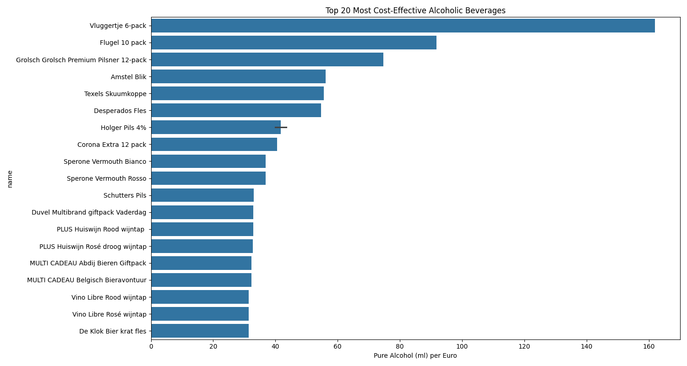
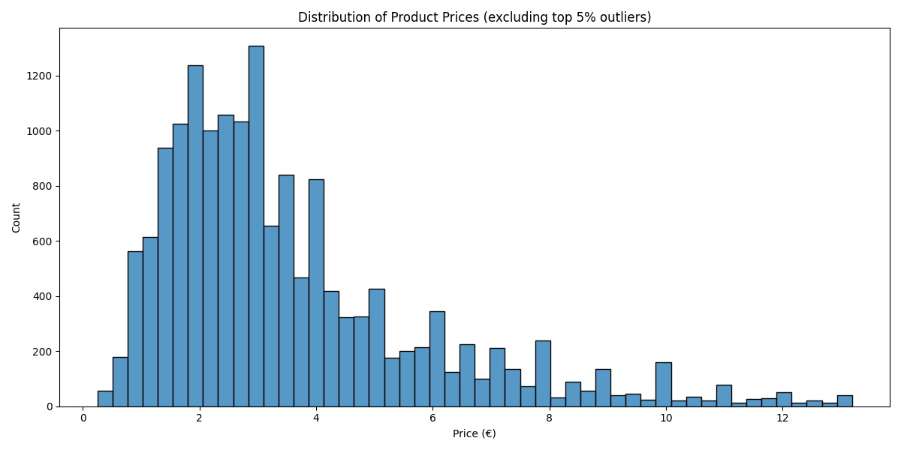
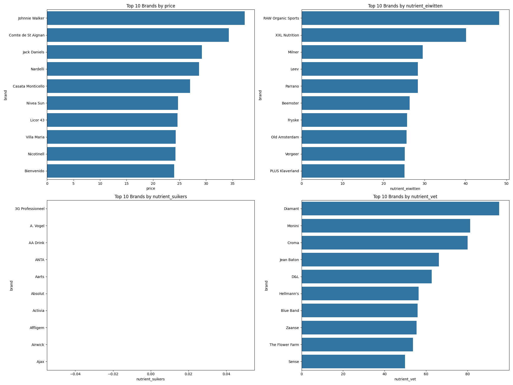
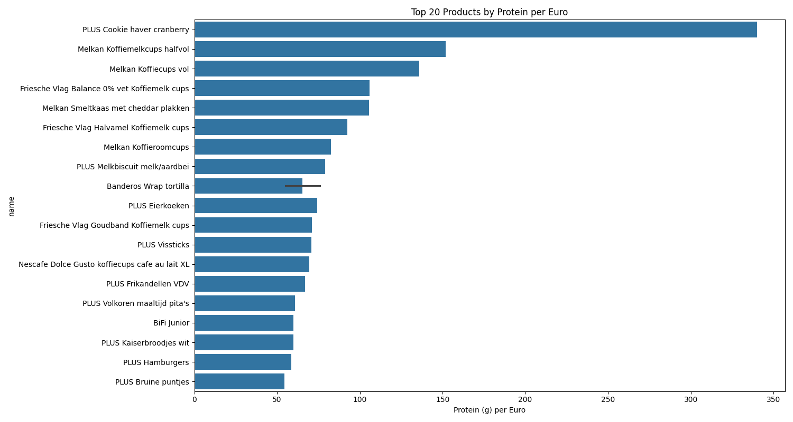
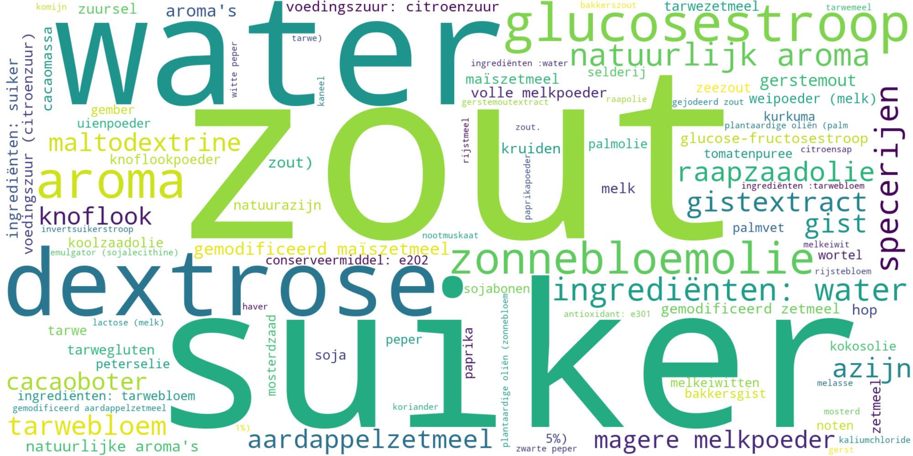
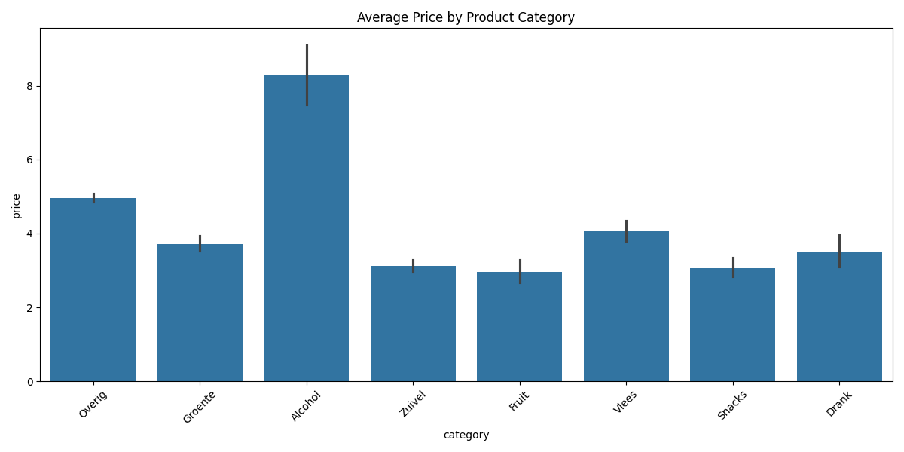

# 🛒 PLUS Product Analyzer

[Lees dit in het Nederlands](README.md)



An extensive scraper and analysis tool for product information from PLUS.nl, including nutritional values, prices, and ingredients.

> **⚠️ Important:** This project is intended for educational purposes. Make sure to respect the terms of use of PLUS.nl and use the scraper responsibly.

> **🔒 Configuration Required:** This is a public repository. All API keys and cookies have been removed. See `docs/COOKIES.md` for configuration instructions.

## Gallery

| Price Distribution | Brand Analysis | Protein Analysis |
| :---: | :---: | :---: |
|  |  |  |

| Ingredients Wordcloud | Alcohol Efficiency | Category Prices |
| :---: | :---: | :---: |
|  |  |  |

## 📋 Table of Contents

- [Prerequisites](#prerequisites)
- [Project Structure](#project-structure)
- [Installation](#installation)
- [Configuration](#configuration)
- [Usage](#usage)
- [Data Analysis](#data-analysis)
- [Troubleshooting](#troubleshooting)
- [Privacy & Ethics](#privacy--ethics)
- [Contributing](#contributing)
- [License](#license)

## 🔑 Prerequisites

**Before you start, you will need:**
- Python 3.8+ and pip
- CSRF token from PLUS.nl (via browser dev tools)
- Valid cookies for API access

📖 **Read first:** `docs/COOKIES.md` for full setup instructions.

## 📁 Project Structure

The project is divided into two main components: the **scraper** and the **data analysis tool**.

```
plusproducten/
├── scraper/                    # 🕷️ Web scraper
│   ├── main.py                # Main scraper script
│   ├── product_scraper.py     # Product detail scraper
│   ├── sitemap_parser.py      # Sitemap parser
│   ├── database.py            # Database management
│   └── data/                  # Scraped data
├── analyze_data.py            # 📊 Data analysis script
├── setup.py                   # 🔧 Automatic setup
└── README.md                  # This documentation
```

## 🛠️ Installation

### Option 1: Automatic Setup (Recommended)

```bash
python setup.py
```
This script automatically installs all requirements and configures the directories.

### Option 2: Manual Setup

```bash
# Install scraper dependencies
pip install -r scraper/requirements.txt

# Install analysis dependencies
pip install -r requirements_analysis.txt

# Create configuration file
cp scraper/.env.example scraper/.env
```

## ⚙️ Configuration

> **🔑 Required:** To use this scraper, you need a CSRF token and cookies from PLUS.nl.

### 1. Environment Setup

```bash
# Copy the template
cp scraper/.env.example scraper/.env

# Edit with your credentials
nano scraper/.env  # or your favorite editor
```

### 2. Obtain CSRF Token & Cookies

See `docs/COOKIES.md` for detailed instructions.

## 🚀 Usage

### Step 1: Scrape Data

```bash
cd scraper

# Scrape the first 50 products (for testing)
python main.py --all --limit 50

# Scrape all products (can take a long time!)
python main.py --all
```

### Step 2: Analyze Data

```bash
# Generate all analyses and visualizations
python analyze_data.py
```

## 📊 Data Analysis

The `analyze_data.py` script generates a series of visualizations and reports in the `scraper/data/analysis` folder. This includes:

- **Price distributions**
- **Brand analyses**
- **Nutritional value analyses** (proteins, calories, etc.)
- **Ingredient word clouds**

The output is saved in `scraper/data/analysis/`, including a `README.md` with the results.

## 🛠️ Troubleshooting

### Common Problems

- **Cookie/Authentication Errors:** Refresh your cookies and CSRF token.
- **Database Errors:** Run `cd scraper && python migrate_db.py`.
- **Analysis Errors:** Make sure you have scraped data first.

### Debug Mode

```bash
cd scraper
python main.py --debug --all --limit 10
```

## 🔒 Privacy & Ethics

- **Respectful scraping:** Built-in delays and rate limiting.
- **Public data:** Only publicly available product information.
- **Educational purpose:** Intended for learning and research.

## 🤝 Contributing

1. Fork the project
2. Create a feature branch
3. Commit your changes
4. Open a Pull Request

## 📄 License

MIT License - see the `LICENSE` file for details.

## ⚠️ Disclaimer

**This project is for educational purposes only.** Respect the terms of service of PLUS.nl and use the tool responsibly.

---

**For questions or problems:** Open an issue on GitHub
