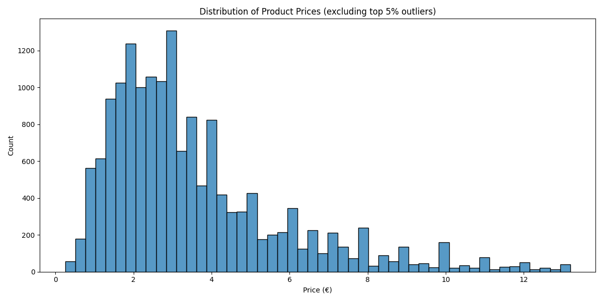
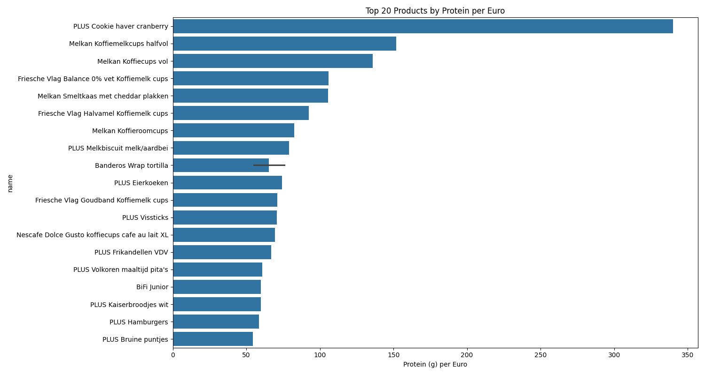

# 🛒 PLUS Product Analyzer


Een uitgebreide scraper en analyse-tool voor productinformatie van PLUS.nl, inclusief voedingswaarden, prijzen en ingrediënten.

> **⚠️ Belangrijk:** Dit project is bedoeld voor educatieve doeleinden. Zorg ervoor dat je de gebruiksvoorwaarden van PLUS.nl respecteert en gebruik de scraper verantwoordelijk.

> **🔒 Configuratie Vereist:** Dit is een openbare repository. Alle API-sleutels en cookies zijn verwijderd. Zie `COOKIES.md` voor configuratie-instructies.

## Gallerij

| Prijsverdeling | Merkanalyse | Eiwitanalyse |
| :---: | :---: | :---: |
|  |  |  |

| Ingrediënten Wordcloud | Alcohol Efficiëntie | Categorieprijzen |
| :---: | :---: | :---: |
|  |  |  |

## 📋 Inhoudsopgave

- [Vereisten voor Gebruik](#vereisten-voor-gebruik)
- [Projectstructuur](#projectstructuur)
- [Installatie](#installatie)
- [Configuratie](#configuratie)
- [Gebruik](#gebruik)
- [Data Analyse](#data-analyse)
- [Voorbeelden](#voorbeelden)
- [Troubleshooting](#troubleshooting)
- [Privacy & Ethiek](#privacy--ethiek)
- [Bijdragen](#bijdragen)
- [Licentie](#licentie)

## 🔑 Vereisten voor Gebruik

**Voordat je begint, heb je nodig:**
- Python 3.8+ en pip
- CSRF token van PLUS.nl (via browser dev tools)
- Geldige cookies voor API toegang

📖 **Lees eerst:** `COOKIES.md` voor volledige setup-instructies.

## 📁 Projectstructuur

Het project is opgedeeld in twee hoofdcomponenten: de **scraper** en de **data-analysetool**.

```
plusproducten/
├── scraper/                    # 🕷️ Web scraper
│   ├── main.py                # Hoofd scraper script
│   ├── product_scraper.py     # Product detail scraper
│   ├── sitemap_parser.py      # Sitemap parser
│   ├── database.py            # Database beheer
│   └── data/                  # Gescrapte data
├── analyze_data.py            # 📊 Data analysescript
├── setup.py                   # 🔧 Automatische setup
└── README.md                  # Deze documentatie
```

## 🛠️ Installatie

### Optie 1: Automatische Setup (Aanbevolen)

```bash
python setup.py
```
Dit script installeert automatisch alle vereisten en configureert de mappen.

### Optie 2: Handmatige Setup

```bash
# Installeer scraper dependencies
pip install -r scraper/requirements.txt

# Installeer analyse dependencies
pip install -r requirements_analysis.txt

# Maak configuratie bestand
cp scraper/.env.example scraper/.env
```

## ⚙️ Configuratie

> **🔑 Vereist:** Voor het gebruik van deze scraper heb je een CSRF token en cookies nodig van PLUS.nl.

### 1. Environment Setup

```bash
# Kopieer de template
cp scraper/.env.example scraper/.env

# Bewerk met je credentials
nano scraper/.env  # of je favoriete editor
```

### 2. Verkrijg CSRF Token & Cookies

Zie `COOKIES.md` voor gedetailleerde instructies.

## 🚀 Gebruik

### Stap 1: Data Scrapen

```bash
cd scraper

# Scrape eerste 50 producten (voor testen)
python main.py --all --limit 50

# Scrape alle producten (kan lang duren!)
python main.py --all
```

### Stap 2: Data Analyseren

```bash
# Genereer alle analyses en visualisaties
python analyze_data.py
```

## 📊 Data Analyse

Het `analyze_data.py` script genereert een reeks visualisaties en rapporten in de `scraper/data/analysis` map. Dit omvat:

- **Prijsverdelingen**
- **Merkanalyses**
- **Voedingswaarde-analyses** (eiwitten, calorieën, etc.)
- **Ingrediënten-wordclouds**

De output wordt opgeslagen in `scraper/data/analysis/`, inclusief een `README.md` met de resultaten.

## 🛠️ Troubleshooting

### Veelvoorkomende Problemen

- **Cookie/Authentication Errors:** Vernieuw je cookies en CSRF-token.
- **Database Errors:** Run `cd scraper && python migrate_db.py`.
- **Analysis Errors:** Zorg dat je eerst data hebt gescraped.

### Debug Mode

```bash
cd scraper
python main.py --debug --all --limit 10
```

## 🔒 Privacy & Ethiek

- **Respectvolle scraping:** Ingebouwde delays en rate limiting.
- **Publieke data:** Alleen publiek beschikbare productinfo.
- **Educatief doel:** Bedoeld voor leren en onderzoek.

## 🤝 Bijdragen

1. Fork het project
2. Maak een feature branch
3. Commit je wijzigingen
4. Open een Pull Request

## 📄 Licentie

MIT License - zie `LICENSE` bestand voor details.

## ⚠️ Disclaimer

**Dit project is alleen voor educatieve doeleinden.** Respecteer de gebruiksvoorwaarden van PLUS.nl en gebruik de tool verantwoordelijk.

---

**Voor vragen of problemen:** Open een issue op GitHub
